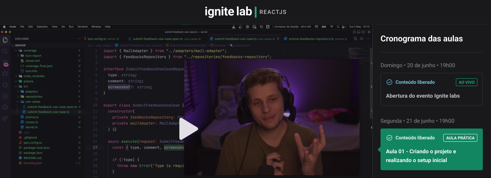

<h2 align="center">🚀 Project Event-Platform created during the Ignite Lab #02 of Rocketseat. 🚀</h2>

<div align="center">
  
</div>

<p align="center">

  

  
  
  <a href="https://github.com/remulocosta/event-platform/commits/master">
    
  </a>

  <a href="https://github.com/remulocosta/event-platform/issues">
    
  </a>

  
</p>

## 📎 Features

- [ ] ...

## :computer: Technologies and tools

This project was made using the following technologies:

- [React.js](https://reactjs.org/)
- [Typescript](https://www.typescriptlang.org/)
- [Vite](https://vitejs.dev/)
- [GraphQL](https://graphql.org/)
- [GraphCMS](https://graphcms.com/)
- [Tailwind CSS](https://tailwindcss.com/)
- [Apollo](https://www.apollographql.com/)

⛏ Tools used outside the training context

- [Jest](https://jestjs.io/)
- [ESLint](https://eslint.org/)
- [Prettier](https://prettier.io/)

## :construction_worker: How to run

```bash
# Clone repository
$ git clone git@github.com:remulocosta/event-platform.git

# Go to folder
$ cd event-platform

# Install dependencies
$ npm i

# Run dev server
$ npm run dev

# Run web server preview
$ npm run build && npm run preview

# use `--host` to expose 
$ npm run build && npm run preview -- --host

## Use `--port` to run server on specific port
$ npm run build && npm run preview -- --host --port 8080
```

## ❔ Questions

If there are any questions regarding this repository, send it to [remulo.costa@gmail.com](mailto:remulo.costa@gmail.com)

Made with ❤︎ by [Remulo Costa](mailto:remulo.costa@gmail.com)

Give a ⭐️ if this project helped you!
